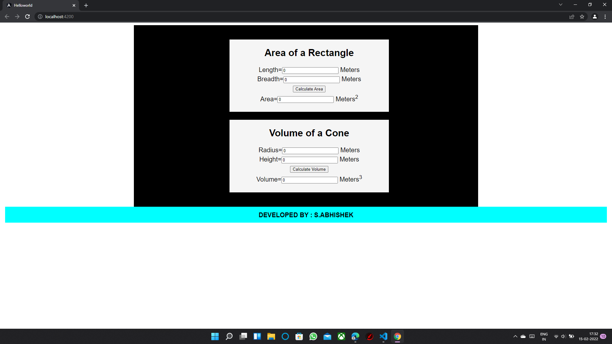

# AngularCalculation

# Web Page for Mathematical Calculations using Angular

## AIM:
To design a dynamic website to perform mathematical calculations using Angular Framwork

## DESIGN STEPS:

### Step 1:

Requirement collection.

### Step 2:

Creating the layout using HTML and CSS in component.html file

### Step 3:

Write typescript to perform the calculations.

### Step 4:

Validate the layout in various browsers.

### Step 5:

Validate the HTML code.

### Step 6:

Publish the website in the given URL.

## PROGRAM :
### app.component.html
~~~
<body>

<Rectanglr-Area></Rectanglr-Area>
 

<Cone-Volume></Cone-Volume>
 

    DEVELOPED BY : S.ABHISHEK

</body>
~~~

### app.component.css
~~~
* {
    box-sizing:border-box;
    font-family: Arial, Helvetica, sans-serif;
  }
 
  .container {
    width:1080px;
    margin-left: auto;
    margin-right: auto;
    padding-top: 20px ;
    padding-left: 300px;
    max-height:max-content;
    background-color:black;
    padding-bottom: 45px; ;
  }
  .content {
    display:block;
    width: 500px;
    background-color:whitesmoke;
    min-height: 150px;
    font-size: 20px;
    position:relative;
    
  }
  h1{
    text-align: center;
    color:black;
  }
  
  .footer {
    display: inline-block;
    width: 100%;
    height: 50px;
    background-color:cyan;
    align-items: center;
    text-align:center;
    font-size: 20px;
    padding-top: 15px;
    margin: 0px 0px 0px 0px;
    color: #000000;
    font-weight: bold;
  }
~~~

### cone.component.html
~~~
<h2>Volume of a Cone</h2>

Radius=<input type="text" [(ngModel)]="radius"> Meters  

Height=<input type="text" [(ngModel)]="height"> Meters  

    <input type="button" (click)="onCalculate()" value="Calculate Volume">  

Volume=<input type="text" [value]="volume"> Meters3

~~~

### cone.component.css
~~~
* {
    box-sizing: border-box;
    font-family: Arial, Helvetica, sans-serif;
  }
  h2{
      text-align: center;
      padding-top: 25px;
  }
  .formelement{
      text-align: center;
      margin-top: 5px;
      margin-bottom: 5px;
  }
~~~

### rectangle.component.html
~~~
<h2>Area of a Rectangle</h2>
    

    Length=<input type="text" [(ngModel)]="length"> Meters  
    

    

    Breadth=<input type="text" [(ngModel)]="breadth"> Meters  
    

    

        <input type="button" (click)="onCalculate()" value="Calculate Area">  
    

    

    Area=<input type="text" [value]="area"> Meters2
    

~~~

### rectangle.component.css
~~~
* {
    box-sizing: border-box;
    font-family: Arial, Helvetica, sans-serif;
  }
  .container {
    width: 1080px;
    margin-left: auto;
    margin-right: auto;
    padding-top: 30px;
    padding-left: 300px;
    padding-bottom: 500px;
  }
  .content {
    display:block;
    width: 500px;
    background-color:white;
    min-height: 150px;
    font-size: 20px;
  }
  h2{
      text-align: center;
      padding-top: 25px;
  }
  .formelement{
      text-align: center;
      margin-top: 5px;
      margin-bottom: 5px;
  }
~~~

## OUTPUT:

## Result:
A math calculations website has been designed using angular framework.
